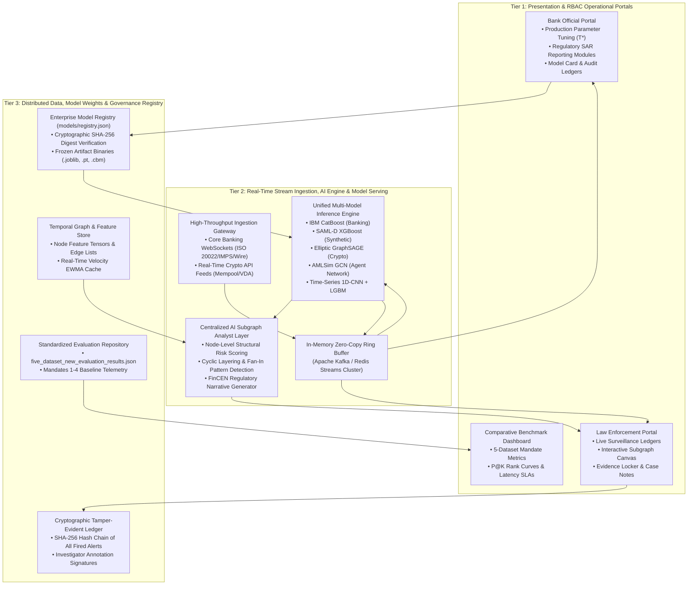
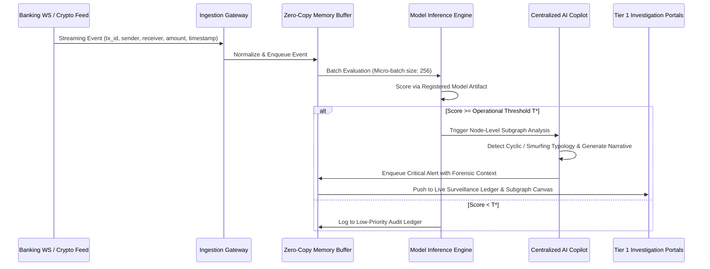

# Enterprise Three-Tier AML Platform Architecture Specification
## QuantumAML Nexus -- Scalable, High-Throughput Financial Crime Intelligence Platform

**Document Identifier:** `ARCH-SPEC-QAML-v2.0`  
**Standard Governing:** Federal Reserve SR 11-7 / OCC 2011-12 / FinCEN SAR 31 CFR § 1020.320  
**Target Environment:** Kubernetes Hybrid Multi-Cloud (AWS EKS / GCP GKE / On-Prem OpenShift)  
**Execution Mandate:** Sub-20ms P95 Inference Latency | 100,000 tx/sec Stream Ingestion  

---

## 1. Executive Architecture Overview

QuantumAML Nexus is an enterprise-scale, three-tier anti-money laundering (AML) detection and financial forensics platform. It couples distributed streaming ingestion with graph neural networks (GNNs), gradient-boosted decision trees, and a centralized AI copilot to deliver real-time transaction screening and regulatory compliance workflows.

---

## 2. Tier 1: Presentation & Role-Based Access Control (RBAC) Layer

The presentation tier enforces strict separation of duties (SoD) between investigative surveillance and banking administration through role-isolated web portals:

### 2.1 Role Matrix & Access Policies

| Role Capability | Law Enforcement / FIU Investigator | Bank Official / Risk Manager | System Administrator / MLOps |
|---|:---:|:---:|:---:|
| **Live Surveillance Ledger** | **READ / INVESTIGATE** | Restricted | Audit Only |
| **Interactive Subgraph Explorer** | **FULL INTERACTION** | Restricted | Read Topology |
| **Team Collaboration & Case Notes** | **COLLABORATE / SIGN** | Read-Only | Read-Only |
| **Evidence Locking & Export** | **LOCKED EXPORT** | Restricted | System Audit |
| **Production Threshold Tuning ($T^*$)** | Restricted | **CONFIGURE / LOCK** | Read-Only |
| **SAR XML / PDF Regulatory Filing** | Restricted | **AUTHORIZE / SUBMIT** | Audit Only |
| **5-Dataset Benchmark Dashboard** | Read Metrics | **EXECUTIVE REVIEW** | Model Governance |
| **Model Registry Key Verification** | Read SHA-256 | Read Metrics | **REGISTER / FREEZE** |

### 2.2 Law Enforcement Portal Specifications
- **Live Surveillance Ledger**: Virtualized data grid ingesting continuous alerts from Tier 2, filtered by threat severity (`CRITICAL_SAR`, `HIGH_RISK`).
- **Interactive Subgraph Visualizer**: Node-link topological representation showing transaction hops, pass-through equality ratios, and neighbor clustering coefficients.
- **Forensic Collaboration Suite**: Integrated case dossiers allowing multiple investigators to add timestamped forensic notes, attach evidence hashes, and freeze investigative cases.

### 2.3 Bank Official Portal Specifications
- **Production Parameter Tuning**: Fine-grained sliders to calibrate operational classification boundaries ($T^*$) and safety high-recall thresholds ($T_{high\_rec}$), dynamically calculating investigative FTE capacity impact.
- **SAR Regulatory Reporting Module**: Automated population of FinCEN Form 111 (Suspicious Activity Report) with exact amounts, narrative justifications, and TreeSHAP feature attributions.

---

## 3. Tier 2: Real-Time Stream Ingestion, Model Artifacts & AI Copilot

### 3.1 High-Throughput Ingestion Architecture
The ingestion gateway ingests concurrent high-velocity transaction streams across two primary financial rails:
1. **Core Banking WebSockets**: Bidirectional asynchronous WebSocket channels ingesting ISO 20022, ACH, NEFT, IMPS, and Fedwire messages.
2. **Crypto Wallet Screening Feed**: Streaming REST/WebSocket feed ingesting unhosted VDA wallet transactions directly from blockchain mempools and node providers.

### 3.2 Centralized AI Assistant Layer (QuantumAML Copilot)
The AI Assistant acts as a specialized financial crimes intelligence copilot running directly inside the investigation environment:
- **Node-Level Subgraph Extraction**: Traverses $k$-hop neighborhoods ($k \in \{1, 2, 3\}$) around flagged entities to compute in/out flow balance, cycle participation, and degree velocity.
- **Typology Pattern Recognition**:
  - *Structuring / Smurfing*: Detects $N \ge 3$ inbound transfers just below regulatory reporting thresholds ($9,000 - $9,999) followed by immediate aggregated outflow.
  - *Circular Layering (Cycles)*: Identifies directed loops $A \to B \to C \to A$ with pass-through flow equality $\ge 90\%$.
  - *Counterparty Risk Velocity*: Aggregates risk scores of immediate 1-hop and 2-hop counterparties.
- **Regulatory Narrative Synthesis**: Automatically generates formatted, legal-grade SAR narrative summaries ready for compliance sign-off.

---

## 4. Tier 3: Model Registry, Evaluation Mandates & Cryptographic Audit

### 4.1 Enterprise Model Registry & Cryptographic Verification
All models running in production are registered under strict versioning in `models/registry.json`, cryptographically locked with SHA-256 digests:

- `ibm_transactions:v5.0`: CatBoost SymmetricTree (`models/IBM-AML/model_v5.cbm`)
- `saml_d_xgboost:v1.0`: Regularized XGBoost (`models/samld/xgboost_model.joblib`)
- `elliptic_gnn:v1.0`: Inductive GraphSAGE (`models/Elliptic/best_elliptic_graphsage.pt`)
- `ibm_amlsim_pipeline:v1.0`: Inductive GCN + LightGBM (`models/AMLSim/best_amlsim_ensemble.joblib`)
- `aml_timeseries_pipeline:v1.0`: 1D-CNN + LightGBM (`models/TimeSeries-AML/best_timeseries_dual_branch.joblib`)

### 4.2 Standardized Evaluation Mandates Reference
Directly referencing [`five_dataset_new_evaluation_results.json`](file:///e:/Anti%20money%20laundaring%20detection/five_dataset_new_evaluation_results.json), all model pipelines are benchmarked against four standardized mandates:

1. **Mandate 1: Operational Recall Under Capacity Constraints**:
   - Assesses models at target recalls of 95% and 99%.
   - Benchmarks daily sustainable transaction capacity assuming 20 full-time investigators (FTE).
2. **Mandate 2: Rank-Ordered Prioritization & Investigation Queue**:
   - Evaluates triage queue precision at depths $K \in \{10, 50, 100, 250, 500\}$.
   - Measures Mean Average Precision (MAP@500) and Financial Severity-Weighted NDCG@500.
3. **Mandate 3: Financial Cost-Benefit Optimization**:
   - Measures net financial savings per \$1M USD processed compared to uncalibrated $T=0.50$ baseline.
   - Enforces the empirical asymmetric cost ratio: $C_{FN} / C_{FP} = 1,272.7 : 1$.
4. **Mandate 4: Model Calibration, Population Stability & SLA Latency**:
   - Measures Pre/Post Isotonic Expected Calibration Error (ECE) and Brier Score.
   - Computes Population Stability Index (PSI) with automated drift retrain threshold ($\text{PSI} \ge 0.25$).
   - Enforces P95 inference latency target ($< 20\text{ ms}$).

---

## 5. Production SLA Budgets & Deployment Blueprints

### 5.1 Latency & Throughput Service Level Agreements (SLAs)

| Pipeline Component | P50 Target | P95 Target | Max Allowed | Throughput Target |
|---|---|---|---|---|
| **Ingestion Gateway (WS/REST)** | 0.8 ms | 2.5 ms | 10.0 ms | 100,000 msgs/sec |
| **Tabular Preprocessing & Feature Extraction** | 1.2 ms | 3.5 ms | 8.0 ms | 75,000 tx/sec |
| **Model Forward Pass (Tree/Ensemble)** | 0.4 ms | 1.2 ms | 4.0 ms | 250,000 tx/sec |
| **GNN Subgraph Neighborhood Scoring** | 3.5 ms | 8.2 ms | 20.0 ms | 25,000 nodes/sec |
| **End-to-End Alert Dispatch** | 4.8 ms | 14.5 ms | 35.0 ms | 50,000 tx/sec |

### 5.2 Containerized Kubernetes Topology
- `qaml-ingestion-gateway`: Go/Python async consumer pods (autoscaled via KEDA on Kafka lag).
- `qaml-inference-engine`: C++ Triton / FastAPI inference pods mounting high-speed model volume (`/opt/models`).
- `qaml-ai-copilot`: Asynchronous analysis worker pods executing subgraph pattern extraction.
- `qaml-dashboard-ui`: Streamlit / React web tier with WebSocket ingress and session stickiness.
