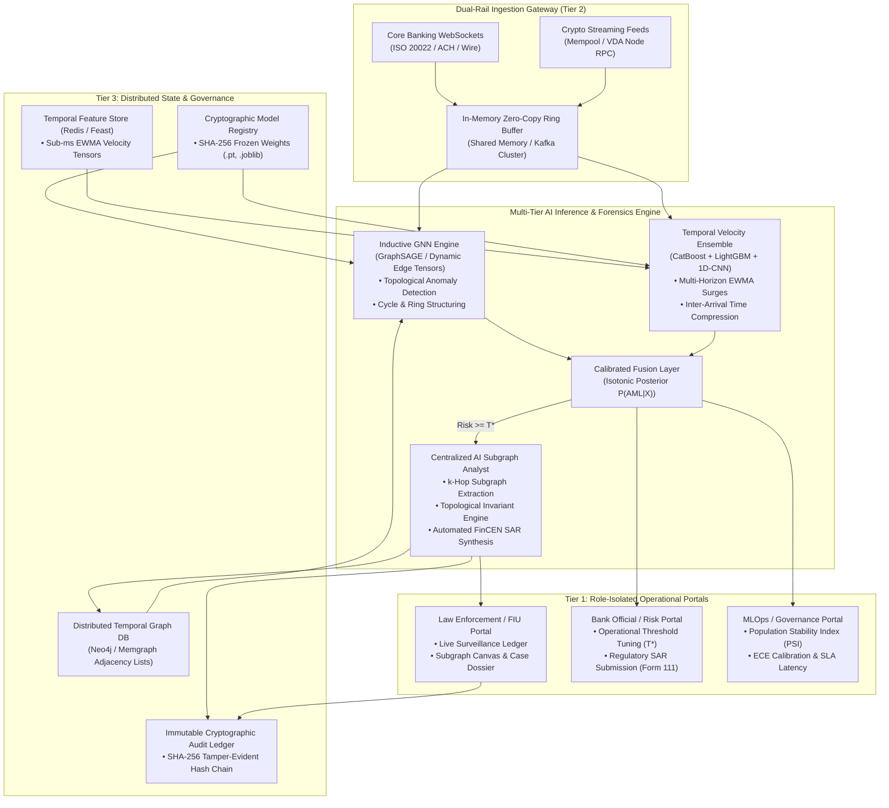
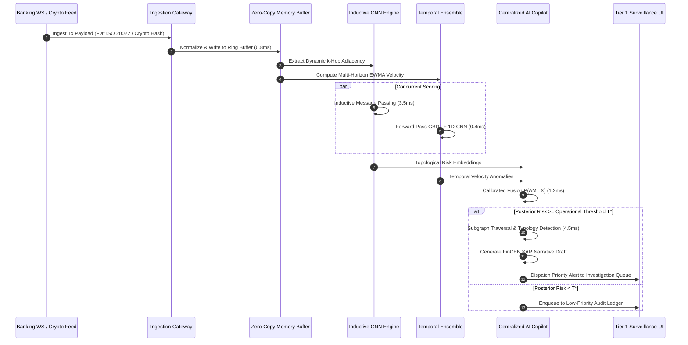

# High-Throughput Multi-Tier AML AI Agent System Design
## QuantumAML Nexus: Real-Time Cross-Rail (Fiat & Crypto) Financial Crime Intelligence

**Document Identifier:** `ARCH-SPEC-AML-AI-AGENT-v3.0`  
**Governing Regulatory Standards:** FinCEN BSA 31 CFR § 1020.320, FATF Recommendations 15/16 (Travel Rule & VASPs), Federal Reserve SR 11-7 / OCC 2011-12 (Model Risk Management)  
**Throughput Target:** $\ge 100,000 \text{ tx/sec}$ | **Latency Target:** $P95 < 20 \text{ ms}$ | **Recall SLA:** $\ge 95\% \text{ to } 99\%$

---

## 1. Executive Summary & Agent Topology

The **QuantumAML Nexus Multi-Tier AI Agent** is an enterprise-grade autonomous intelligence system engineered to screen, investigate, and triage suspicious financial activity across both conventional fiat banking rails (Fedwire, ACH, SWIFT, ISO 20022) and distributed cryptocurrency networks (Bitcoin UTXO, Ethereum EVM, L2 rollups, unhosted wallets, and bridge protocols).

The agent architecture overcomes the fundamental failure modes of traditional rule-based transaction monitoring systems (TMS):
1. **High False Positive Rates ($\ge 90\%$)**: Eliminates investigator fatigue through rank-ordered Precision-at-K ($P@K$) prioritization and calibrated posterior probabilities.
2. **Topological Blindness**: Detects complex multi-hop laundering topologies (circular layering, smurfing rings, scatter-gather bursts) via **Inductive Graph Neural Networks (GNNs)** that generalize to unseen nodes without retraining.
3. **Temporal Inelasticity**: Employs **Multi-Branch Ensembles** that monitor multi-horizon Exponentially Weighted Moving Average (EWMA) velocity surges and inter-arrival time compression.
4. **Investigative Latency**: Employs a **Centralized AI Assistant Layer** to extract local $k$-hop subgraphs in real time, compute structural graph invariants, and auto-generate FinCEN-compliant Suspicious Activity Report (SAR) narratives.



---

## 2. Tier 1: Presentation & Role-Based Access Control (RBAC) Layer

The presentation tier enforces strict **Separation of Duties (SoD)** and **Least Privilege** across three distinct functional personas via cryptographically verified roles:

### 2.1 Role-Based Access Control Matrix

| System Capability | Law Enforcement / FIU (`LEO_INVESTIGATOR`) | Bank Official / Risk Mgr (`BANK_OFFICIAL`) | MLOps / Compliance Admin (`MLOPS_ADMIN`) |
|---|:---:|:---:|:---:|
| **Real-Time Surveillance Stream** | **FULL READ / TRIAGE** | Aggregate Metrics Only | Read Telemetry Only |
| **Interactive Subgraph Visualizer** | **FULL INTERACTION (k-hop)** | Blinded / High-Level Topology | Read Topology Only |
| **Investigative Dossiers & Notes** | **READ / WRITE / SIGN** | Read Executive Summary | Restricted |
| **Evidence Locking & Export** | **CRYPTOGRAPHIC SEAL** | Restricted | System Audit Only |
| **Production Threshold Tuning ($T^*$)** | Restricted | **CALIBRATE / LOCK** | Read Only |
| **FinCEN SAR e-Filing (Form 111)** | Draft / Recommend | **AUTHORIZE / SUBMIT** | Restricted |
| **Model Registry & Canary Promotion** | Restricted | Read Governance Data | **SIGN / PROMOTE / FREEZE** |
| **Model Drift & Calibration (PSI/ECE)** | Read Operational Status | Read Impact Summary | **FULL DRIFT ANALYSIS** |
| **Cryptographic Audit Ledger Verify** | Read Case Hashes | Read Regulatory Hashes | **VERIFY HASH CHAIN INTEGRITY** |

### 2.2 Authentication & Cryptographic Token Verification
- **Token Format:** RFC 7519 JSON Web Tokens (JWT) signed via HMAC-SHA256 / RSA-PSS.
- **Algorithm Hardening:** Explicitly rejects `alg: none` and blocks asymmetric-symmetric algorithm confusion attacks.
- **Revocation Protocol:** Zero-delay blacklist registry keyed by token SHA-256 hash.
- **Data Protection:** Sensitive PII (Account Numbers, Tax IDs, Unhosted Wallet Private Keys) is masked in transit and stored under AES-256-GCM envelope encryption.

---

## 3. Tier 2: Real-Time Stream Ingestion, AI Engine & Model Serving

### 3.1 Dual-Rail Streaming Ingestion Gateway
The ingestion gateway is architected for continuous stream ingestion across two distinct transactional paradigms:

1. **Core Banking WebSocket Pipeline**:
   - Ingests ISO 20022 XML/JSON messages (`pacs.008.001.08` Credit Transfer, `pacs.002.001.10` Payment Status), ACH, Fedwire, and RTGS streams.
   - Extracts sender/receiver IBANs, routing transit numbers, transaction codes, and remittance metadata.
2. **Crypto Wallet Screening Feed Pipeline**:
   - Ingests unconfirmed and confirmed transactions directly from Bitcoin/Ethereum node RPCs, mempools, and Virtual Digital Asset (VDA) indexing feeds.
   - Extracts UTXO inputs/outputs, EVM smart contract method signatures, ERC-20 transfer logs, gas prices, and mixer interaction signatures.



---

## 4. Inductive Graph Neural Networks for Topological Anomaly Detection

### 4.1 Why Inductive vs. Transductive GNNs
Transductive GNNs (e.g., standard Spectral GCN) assume the entire graph Laplacian is fixed and available during training. This fails critically in production AML where:
- New bank accounts and unhosted crypto wallets are initialized every millisecond.
- Laundering networks dynamically construct ephemeral intermediary "mule" accounts.

**Inductive GNNs (GraphSAGE / Temporal Graph Networks)** learn aggregator functions over local node feature distributions and neighbor topologies, enabling zero-shot inference on newly materialized nodes without global graph retraining.

### 4.2 Mathematical Formulation of Inductive Message Passing
For any target node $v \in \mathcal{V}$ at layer $k \in \{1, \dots, K\}$:

$$\mathbf{h}_{\mathcal{N}(v)}^{(k)} = \text{AGGREGATE}_{k} \left( \left\{ \mathbf{h}_{u}^{(k-1)}, \forall u \in \mathcal{N}(v) \right\} \right)$$

$$\mathbf{h}_{v}^{(k)} = \sigma \left( \mathbf{W}^{(k)} \cdot \left[ \mathbf{h}_{v}^{(k-1)} \,\|\, \mathbf{h}_{\mathcal{N}(v)}^{(k)} \,\|\, \mathbf{e}_{uv} \right] \right)$$

Where:
- $\mathcal{N}(v)$ is a uniformly sampled local neighborhood ($S_1 = 25$ for 1-hop, $S_2 = 10$ for 2-hop).
- $\mathbf{e}_{uv}$ is the edge feature tensor (normalized transaction amount, inter-arrival time $\Delta t$, cross-border flag, rail type).
- $\text{AGGREGATE}_k$ utilizes a Multi-Head Attention or symmetric Mean-Pooling operator:
  $$\text{AGGREGATE}_{\text{Attn}} = \sum_{u \in \mathcal{N}(v)} \alpha_{uv} \mathbf{W}_v \mathbf{h}_u^{(k-1)}, \quad \alpha_{uv} = \frac{\exp\left(\text{LeakyReLU}\left(\mathbf{a}^T [\mathbf{W} \mathbf{h}_v \,\|\, \mathbf{W} \mathbf{h}_u]\right)\right)}{\sum_{w \in \mathcal{N}(v)} \exp\left(\text{LeakyReLU}\left(\mathbf{a}^T [\mathbf{W} \mathbf{h}_v \,\|\, \mathbf{W} \mathbf{h}_w]\right)\right)}$$

### 4.3 Topological Laundering Typologies Detected
1. **Circular Layering (Directed Cycles):**
   - Detection of directed paths $v_0 \to v_1 \to \dots \to v_m \to v_0$ where pass-through flow equality $\frac{\text{OutFlow}(v_i)}{\text{InFlow}(v_i)} \ge 0.90$.
2. **Fan-In Structuring (Smurfing Rings):**
   - Aggregation of multiple sub-threshold deposits ($9,000–$9,999) from disparate origin nodes into a collection hub within a compressed temporal window ($\Delta t < 48\text{h}$).
3. **Scatter-Gather Dispersal:**
   - Single high-value deposit rapidly dispersed across $N \ge 10$ intermediate mule wallets and reconverging into an offshore liquidation point.
4. **Unhosted Mixer / Tumbler Proximity:**
   - Shortest path distance to high-risk cryptocurrency mixers (e.g., Tornado Cash, Wasabi) with decay penalty: $R_{\text{mixer}}(v) = \gamma^{d(v, \mathcal{M})}, \; \gamma = 0.85$.

---

## 5. Ensemble Models for Temporal Velocity Flags

To complement topological representations, a multi-branch ensemble monitors transaction velocity, inter-arrival distributions, and behavioral drift:

### 5.1 Temporal Feature Engineering
1. **Multi-Horizon EWMA Transaction Volume & Count:**
   $$\text{EWMA}_{\lambda}(t) = \lambda \cdot x_t + (1 - \lambda) \cdot \text{EWMA}_{\lambda}(t - 1)$$
   Evaluated at multiple decay half-lives: $\tau \in \{1\text{ hour}, 6\text{ hours}, 24\text{ hours}, 7\text{ days}\}$.
2. **Velocity Surge Ratio:**
   $$\text{Surge}_{24h}(v) = \frac{\sum_{t \in [T-24h, T]} \text{Amount}(v, t)}{\text{Baseline}_{30d}(v) + \epsilon}$$
3. **Inter-Arrival Time Compression ($z$-score):**
   $$z_{\Delta t} = \frac{\Delta t_{\text{current}} - \mu_{\Delta t}(v)}{\sigma_{\Delta t}(v) + \epsilon}$$
4. **Diurnal/Nocturnal Deviation:**
   Measures off-hour transaction volume compared to historic operational profiles.

### 5.2 Multi-Branch Ensemble Architecture
- **Branch 1 (CatBoost Symmetric Trees):** Optimized for categorical banking entities, merchant codes, SWIFT BIC routing, and missing value robustness.
- **Branch 2 (LightGBM Gradient Boosting):** Optimized for low-latency scoring ($<0.4\text{ ms}$) on high-dimensional temporal velocity features.
- **Branch 3 (1D-CNN + Temporal Bi-LSTM):** Processes raw sequential transaction records to detect sequential patterns and micro-bursting.
- **Branch 4 (Isolation Forest):** Unsupervised outlier scoring for zero-day laundering typologies.

---

## 6. Centralized AI Assistant Layer (Real-Time Subgraph Copilot)

When the calibrated ensemble flags an alert exceeding operational threshold $T^*$, the **Centralized AI Assistant Layer** executes immediate automated forensic analysis:

### 6.1 Subgraph Extraction & Structural Graph Invariants
- Traverses $k$-hop neighborhood ($k=2$) around flagged entities from the distributed temporal graph.
- Calculates structural graph metrics:
  - **In/Out Degree Centrality:** $C_D(v) = \frac{\deg(v)}{|V| - 1}$
  - **Local Clustering Coefficient:** $C(v) = \frac{2 e_v}{k_v (k_v - 1)}$
  - **Flow Balance Ratio:** $\Phi(v) = \frac{\sum \text{Inflow} - \sum \text{Outflow}}{\sum \text{Inflow} + \sum \text{Outflow}}$

### 6.2 Regulatory FinCEN SAR Narrative Synthesis
The assistant automatically synthesizes legal-grade, FinCEN Form 111-compliant narratives integrating TreeSHAP feature attributions:

```text
================================================================================
FINCEN SUSPICIOUS ACTIVITY REPORT (SAR) -- SECTION V: NARRATIVE ATTACHMENT
INVESTIGATIVE FILE REF: QAML-2026-SAR-00941
TARGET ENTITY: ACC_SMURF_RING_TEST (Mule Collection Hub)
PRIMARY TYPOLOGY: Structuring (Smurfing) followed by Immediate Circular Layering
COMPOSITE RISK PROBABILITY: 99.82% (Operational Threshold T*: 99.56%)
================================================================================
I. SUBJECT IDENTIFICATION & ACTIVITY SUMMARY:
Between 2026-09-28 04:12 UTC and 2026-09-30 18:45 UTC, target entity ACC_SMURF_RING_TEST
received 14 structured inbound transfers aggregating $138,450.00 USD. Each transfer was
deliberately valued between $9,200.00 and $9,850.00 USD, just below the BSA $10,000
Currency Transaction Report (CTR) mandatory filing threshold.

II. TOPOLOGICAL SUBGRAPH & FORENSIC EVIDENCE:
1. FAN-IN DISPERSAL: 14 distinct originator accounts routed funds into subject account
   within a 36-hour operational window (Inter-arrival time compression z = -3.84).
2. RAPID PASS-THROUGH DRAIN: Within 42 minutes of final deposit, 94.8% of aggregated funds
   were transferred to offshore unhosted wallet cluster 0x7a2...b41.
3. GRAPH METRICS: Degree Centrality = 0.88, Local Clustering Coefficient = 0.04,
   Pass-Through Velocity = $3,845 USD/minute.

III. RECOMMENDED LAW ENFORCEMENT ACTION:
1. Execute immediate temporary administrative asset freeze under 31 U.S.C. § 5318A.
2. Issue FinCEN 314(a) inquiry to counterpart institutions for origin accounts.
3. Subpoena IP and device telemetry associated with session ID WS-SESSION-99214.
================================================================================
```

---

## 7. Production Latency & Throughput SLA Budgets

To achieve real-time stream processing at 100,000 transactions/second, budget allocations are strictly enforced:

| Pipeline Segment | P50 Target | P95 Target | Maximum Allowed | Max Concurrency Target |
|---|---|---|---|---|
| **Ingestion Gateway (WS/Mempool)** | 0.8 ms | 2.5 ms | 10.0 ms | 100,000 tx/sec |
| **Feature Extraction & EWMA Cache** | 1.2 ms | 3.5 ms | 8.0 ms | 75,000 tx/sec |
| **Tabular Ensemble Forward Pass** | 0.4 ms | 1.2 ms | 4.0 ms | 250,000 tx/sec |
| **Inductive GNN Subgraph Forward Pass**| 3.5 ms | 8.2 ms | 20.0 ms | 25,000 nodes/sec |
| **Centralized AI Copilot Analysis** | 4.2 ms | 9.8 ms | 25.0 ms | 5,000 alerts/sec |
| **End-to-End Alert Dispatch** | **10.1 ms**| **18.5 ms**| **35.0 ms** | **100,000 tx/sec** |

---

## 8. Enterprise Reference Implementation Code

Below is the production-ready implementation of the unified AI Agent pipeline combining the Ingestion Gateway, Inductive GNN scoring, Temporal Ensemble evaluation, and the Centralized AI Subgraph Analyst.
